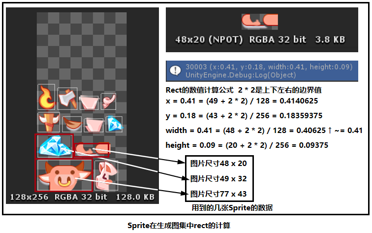

# MakeIconAtlas
图集制作工具,可以导出单图图集和多图图集目前项目内的生成单图和图集的脚本

### 一 MakeIconAtlas 图集生成

#### 工作原理流程

脚本功能,将单图输出成单图图集至Assets/Things/Textures/Icon/Single对应的文件夹目录下，将多图目录中所有子图片资源打包成一张大图图集输出至Assets/Things/Textures/Icon/Mutliple对应的目录下

#### 工作流程:

首先判断选中的对象是文件夹还是一个Png图片,然后分支成文件夹模式EnterByFolder(path)和文件模式EnterByFile(path)进行处理，两种模式异曲同工，都会去判断选中的对象路径是否包含单图或多图路径，进而流程分支为单图处理模式PackSingleMode(path)和多图处理模式PackFolderMode(folderPath)。
两种处理模式都会进行贴图的导入，区别在于单图直接将图片资源处理成单图图集输出至单图目录，进入CreateSingleModeAtlas(path, atlasPath)分支，多图需要将路径文件夹所有的贴图资源进行导入，然后将每一张贴图处理到一张大图图集，使用的是Unity自带的打包图集方法Texture2D.PackTextures()，进入CreateFolderModeAtlas(paths, atlasPath)分支。
单图的打包较为简单，将读取到的Texture资源进行按路径写入AtlasWriter.Write(texture, atlasPath)即可，然后进行一些设置，主要由TextureImporter对象来完成，该对象进行图集的一些参数进行设置
多图的打包多了一步，在遍历路径列表得到每一张贴图之后，对所有的贴图进行了TextureClamper.Clamp(textures[i])操作，该方法是为了给每一张贴图加上2 pixel的包围框，目的是消除界面缩放时出现黑标或透明边的现象，因为贴图采样的时候每张图集不进行分割的话在计算UV的时候会采样到相邻的贴图像素。

### Unity API

* 导入资源:AssetDatabase.ImportAsset 
* 资源导入选项:ImportAssetOptions
* 在path处检索资源的资源导入器:AssetImporter.GetAtPath 
* 纹理导入器(修改Texture2D的导入设置):TextureImporter
* 纹理打包:Texture2D.PackTextures
* 用于生成Sprite的编辑器数据:SpriteMetaData
* 设置特定的目标平台设置:TextureImporter.SetPlatformTextureSettings
* 纹理导入格式:TextureImporterFormat

#### IconProcessor Icon处理工具
```csharp
using System;
using System.IO;
using System.Linq;
using UnityEngine;
using UnityEditor;
using System.Collections;
using System.Collections.Generic;
using Object = UnityEngine.Object;
namespace EditorTools.UI {
    // 处理Icon资源，分成两种模式，Single：每一张Icon图片做成一个独立的图集，Mutilple：将一个目录下的所有图片合成一个图集
    // Single和Mutilple对应Assets/Icon目录下两个文件夹 因为Icon需要使用内建的Sprite Packer分离通道的功能，所以Icon目录不能放在Resources目录下
    public class IconProcessor {
        public const int ATLAS_MAX_SIZE = 2048;
        public const int FAVOR_ATLAS_SIZE = 1024;
        public const string ICON_ROOT = "Assets/IconOrigin";
        public const string SINGLE_ROOT = "Assets/IconOrigin/Single";
        public const string MUTLIPLE_ROOT = "Assets/IconOrigin/Mutliple";
        // UI预设中不可以引用Icon图标
        public const string ICON_OUT_ROOT = "Assets/Icon";
        public const string SINGLE_OUT_ROOT = "Assets/Icon/Single";
        public const string MUTLIPLE_OUT_ROOT = "Assets/Icon/Mutliple";

        [MenuItem("Assets/MakeIconAtlas", false, 102)]
        public static void Main() { //主方法,MakeIconAtlas进来执行的地方
            Object[] objs = Selection.GetFiltered(typeof(Object), SelectionMode.Assets);//过滤选中的对象,这里只筛选Assets类型的
            foreach (Object obj in objs) { //遍历筛选过后选中的内容
                string path = AssetDatabase.GetAssetPath(obj); //获取obj的路径
                string selectedPath = GetSelectedPath(path); //检测路径,按照上面预定义的路径进行审核,返回通过审核的路径
                if (string.IsNullOrEmpty(selectedPath) == true) { //这里做兼容和判空
                    return;
                }
                Debug.Log("Selected Path: " + selectedPath);
                if (selectedPath.Contains(".png") == true) { //选择的路径包含了.png字段
                    EnterByFile(selectedPath); //文件模式
                } else {
                    EnterByFolder(selectedPath);//文件夹
                }
            }
        }

        //文件模式
        private static void EnterByFile(string path) {
            if (path.Contains(SINGLE_ROOT) == true) { //路径包含单图路径
                PackSingleMode(path);//打包单图
            } else if (path.Contains(MUTLIPLE_ROOT) == true) { //包含多图路径
                string folderPath = GetFolderPath(path); //记录文件夹路径
                PackFolderMode(folderPath);//按文件夹路径打包文件夹内图片的图集
            }
        }
        //文件夹模式
        private static void EnterByFolder(string path) {
            if (path.Contains(SINGLE_ROOT) == true) { //包含单图路径
                string[] paths = GetAssetPaths(path);//选中单图路径下的所有文件,并把每个文件的路径返回到paths数组
                foreach (string s in paths) { //遍历资源路径列表
                    PackSingleMode(s);//打单图
                }
            } else if (path.Contains(MUTLIPLE_ROOT) == true) { //包含多图路径
                if (path.Length > MUTLIPLE_ROOT.Length) { //路径string长度大于多图根路径长度,说明选择了一个多图文件夹路径
                    PackFolderMode(path);//按多图路径打包
                } else { //处理选中了多图文件夹根目录的情况,把根目录包含的子文件夹都进行打包
                    string[] paths = GetSubFolderPaths(path); //划分成每个多图文件夹目录
                    foreach (string s in paths) { //遍历多个目录
                        PackFolderMode(s); //按每个多图路径打包
                    }
                }
            }
        }
        //传入一个文件夹的路径
        private static string[] GetSubFolderPaths(string folderPath) {
            string[] result = Directory.GetDirectories(folderPath); //返回文件夹目录下所有文件夹的路径到result数组
            for (int i = 0; i < result.Length; i++) { //遍历数组
                result[i] = result[i].Replace(@"\", @"/"); //把所有的'\'替换成'/'
            }
            return result; //返回替换好文件路径的路径数组
        }
        //路径下的所有文件,并把每个文件的路径返回到result数组
        private static string[] GetAssetPaths(string folderPath) {
            //筛选
            //SearchOption.TopDirectoryOnly默认选项，仅包含当前目录     SearchOption.AllDirectories包含所有子目录
            // "*.*",代表模糊搜索,检索出带.的文件,"s => s.Contains(".meta") == false"表示过滤掉meta文件
            string[] result = Directory.GetFiles(folderPath, "*.*", SearchOption.TopDirectoryOnly).Where<string>(s => s.Contains(".meta") == false).ToArray<string>();
            for (int i = 0; i < result.Length; i++) { //通过过滤的文件列表,此时只包含图片资源
                result[i] = result[i].Replace(@"\", @"/");//把所有的'\'替换成'/'
            }
            return result;
        }
        //获取文件路径的目录
        private static string GetFolderPath(string path) {
            int lastSlashIndex = path.LastIndexOf(@"/"); //获取最后一个'/'的字符索引
            return path.Substring(0, lastSlashIndex);//0 - 最后一个/字符索引即文件的目录
        }
        //文件夹打包模式
        private static void PackFolderMode(string path) {
            string[] paths = GetAssetPaths(path); //获取文件夹下所有子文件Asset类型的路径,过滤掉Unity的.meta文件
            foreach (string s in paths) { //遍历Asset的路径列表,将每一个图片都进行导入
                ImportReadableTexture(s); //导入贴图
            }
            //atlasPath 是最终输出的图片路径.png
            string atlasPath = path.Replace(MUTLIPLE_ROOT, MUTLIPLE_OUT_ROOT) + ".png";//这里的path表示目录路径且结尾不含/,将多图路径替换成多图输出路径
            string folderPath = Path.GetDirectoryName(atlasPath);//返回指定路径字符串的目录信息,存在哪个文件夹
            if (Directory.Exists(folderPath) == false) { //不存在该文件夹就创建一个新的
                Directory.CreateDirectory(folderPath);
            }
            CreateFolderModeAtlas(paths, atlasPath); //paths assets的路径列表
        }

        private static void PackSingleMode(string path) {
            ImportReadableTexture(path); //导入贴图
            string atlasPath = path.Replace(SINGLE_ROOT, SINGLE_OUT_ROOT);//单图的输出路径
            string folderPath = Path.GetDirectoryName(atlasPath);//返回指定路径字符串的目录信息,存在哪个文件夹
            if (Directory.Exists(folderPath) == false) { //不存在该文件夹就创建一个新的
                Directory.CreateDirectory(folderPath);
            }
            CreateSingleModeAtlas(path, atlasPath);//单图创建模式 path assets的路径列表
        }
        //将path路径的单图生成单图图集到atlasPath路径
        private static void CreateSingleModeAtlas(string path, string atlasPath) {
            Texture2D texture = AssetDatabase.LoadAssetAtPath(path, typeof(Texture2D)) as Texture2D; //把texture2D的贴图数据加载出来
            AtlasWriter.Write(texture, atlasPath);//将贴图数据写入atlasPath
            AssetDatabase.ImportAsset(atlasPath, ImportAssetOptions.ForceUpdate);//导入数据
            TextureImporter importer = AssetImporter.GetAtPath(atlasPath) as TextureImporter;//获取路径下的单图图片上的TextureImporter
            if (importer == null) { Debug.LogError("发现不是图片的资源, 资源路径 = " + atlasPath); return; } //不是图片资源就报错,找不到TextureImporter
            importer.textureType = TextureImporterType.Sprite;//贴图模式为Sprite
            importer.spriteImportMode = SpriteImportMode.Single;//导入模式为单图
            importer.spritePixelsPerUnit = 1;//图片中多少个像素对应Unity项目中的1个unit
            importer.maxTextureSize = ATLAS_MAX_SIZE;//最大尺寸
            importer.isReadable = false;//关闭可读
            importer.mipmapEnabled = false;//mipMapEnable关闭
            importer.crunchedCompression = true;//使用经过 Crunch 处理的压缩(如果可用)
            importer.spritePackingTag = "";
            //TextureImporterUtil.SetAtlasPackingTag(atlasPath, texture.name);
            AssetDatabase.ImportAsset(atlasPath, ImportAssetOptions.ForceUpdate);//导入资源数据
        }
        //将一个多图文件夹的所有贴图资源的纹理数据打包填充成一张大贴图
        private static void CreateFolderModeAtlas(string[] paths, string atlasPath) {
            Texture2D[] textures = new Texture2D[paths.Length]; //Texture数组,一个多图文件夹中包含的图片个数,每个图片资源对应一个Texture
            string[] textureNames = new string[textures.Length]; //texture的资源名称数组
            for (int i = 0; i < textures.Length; i++) { //遍历
                textures[i] = AssetDatabase.LoadAssetAtPath(paths[i], typeof(Texture2D)) as Texture2D; //按路径加载贴图资源
                textureNames[i] = textures[i].name;//命名
                textures[i] = TextureClamper.Clamp(textures[i]); //填充图集的Texture数据
            }
            Texture2D atlas = new Texture2D(ATLAS_MAX_SIZE, ATLAS_MAX_SIZE); //创建图集
            //将多个纹理打包到一个纹理图集中。Rect[] 包含每个输入纹理在图集中的 UV 坐标的矩形数组，如果打包失败，则为 null。
            //rects 为每个texture的矩形框数组
            Rect[] rects = atlas.PackTextures(textures, 0, ATLAS_MAX_SIZE, false);//textures要打包到图集的纹理的数组,0 纹理间的像素填充,ATLAS_MAX_SIZE 纹理最大尺寸,false,不可读?false
            AtlasWriter.Write(atlas, atlasPath);//写入纹理数据
            AssetDatabase.ImportAsset(atlasPath, ImportAssetOptions.ForceUpdate);//导入atlasPath路径下的资源,由用户发起的资源导入。
            //将每一张sprite导入一个大图集,路径,uv信息,名称,边界vector4精灵的边缘边框大小[以像素为单位]X=左边框/Y=下边框/Z=右边框/W=上边框
            TextureImporterUtil.CreateMultipleSpriteImporter(
                 atlasPath,//大图的路径
                 rects,//每张Sprite的矩形UV框
                textureNames,//每张Sprite的名称
                new Vector4[textures.Length],//border数组
                atlas.width,//图集的宽度
                atlas.height,//图集的高度
                ATLAS_MAX_SIZE,//图集的最大尺寸
                 TextureImporterFormat.DXT5 //纹理导入的格式
             );
            //TextureImporterUtil.SetAtlasPackingTag(atlasPath, GetPackingTagFromPath(atlasPath));
            AssetDatabase.ImportAsset(atlasPath, ImportAssetOptions.ForceUpdate);//导入atlasPath路径下的资源,由用户发起的资源导入。
        }

        //导入贴图
        private static void ImportReadableTexture(string path) {
            TextureImporterUtil.CreateReadableTextureImporter(path);//创建导入器
            AssetDatabase.ImportAsset(path, ImportAssetOptions.ForceUpdate);
        }

        //检测资源文件路径和文件夹路径
        private static string GetSelectedPath(string path) {
            if (path.Contains(SINGLE_ROOT) == false && path.Contains(MUTLIPLE_ROOT) == false) { //路径不包含单图路径也不包含多图路径,检测不通过
                Debug.LogError("选择的路径是： " + path + " 错误，请选择Assets/IconOrigin/Single或Assets/IconOrigin/Mutliple目录下icon资源~");
                return string.Empty;
            }
            if (path.Contains(SINGLE_OUT_ROOT) == true || path.Contains(MUTLIPLE_OUT_ROOT) == true) { //路径包含了单图输出目录或者多图输出目录,检测不通过
                Debug.LogError("选择的路径是： " + path + " 错误，请选择Assets/IconOrigin/Single或Assets/IconOrigin/Mutliple目录下icon资源~");
                return string.Empty;
            }
            return path;
        }
    }
}
```

#### TextureImporterUtil 贴图导入工具
```csharp
using System;
using System.Collections.Generic;
using System.Linq;
using System.Text;
using UnityEditor;
using UnityEngine;

using EditorTools.AssetBundle;
using EditorTools.UI;

public class TextureImporterUtil {
    public static bool useToolCut = false;
    //创建贴图导入的设置对象
    public static TextureImporterPlatformSettings CreateImporterSetting(string name, int maxSize, TextureImporterFormat format, int compressionQuality = 100,
         bool allowsAlphaSplitting = false, TextureImporterCompression tc = TextureImporterCompression.Uncompressed) {
        TextureImporterPlatformSettings tips = new TextureImporterPlatformSettings();
        tips.overridden = true;
        tips.name = name;
        tips.maxTextureSize = maxSize;
        tips.format = format;
        tips.textureCompression = tc;
        tips.allowsAlphaSplitting = allowsAlphaSplitting;
        tips.compressionQuality = compressionQuality;

        return tips;
    }
    //导入贴图,并返回一个AssetsImport对象
    public static void CreateReadableTextureImporter(string path) {
        TextureImporter importer = AssetImporter.GetAtPath(path) as TextureImporter;
        if (importer == null) {
            Debug.LogError("发现不是图片的资源, 资源路径 = " + path);
            return;
        }
        importer.textureType = TextureImporterType.Sprite;
        importer.npotScale = TextureImporterNPOTScale.None;
        importer.isReadable = true;
        importer.mipmapEnabled = false;
        //为import对象进行导入参数的设置
        importer.SetPlatformTextureSettings(TextureImporterUtil.CreateImporterSetting(GetTextureBuildTargetName(), 2048, TextureImporterFormat.RGBA32));
    }

    // 返回贴图打包的平台名字
    public static string GetTextureBuildTargetName() {
        switch (AssetPathHelper.GetBuildTarget()) {
            case BuildTarget.StandaloneWindows:
            case BuildTarget.StandaloneWindows64:
            case BuildTarget.StandaloneOSX:
                return "Standalone";
            case BuildTarget.Android:
                return "Android";
            case BuildTarget.iOS:
                return "iPhone";
        }
        return "Standalone";
    }
    //多图导入Importer的设置 参数列表含义
    //path 路径,rects uv坐标和大小
    public static void CreateMultipleSpriteImporter(string path, Rect[] rects, string[] spriteNames, Vector4[] borders, int width, int height, int maxSize, TextureImporterFormat format) {
        TextureImporter importer = AssetImporter.GetAtPath(path) as TextureImporter; //贴图导入器
        if (importer == null) { Debug.LogError("发现不是图片的资源, 资源路径 = " + path); return; } //资源不属于图片资源,无法获取资源上的贴图导入器
        importer.textureType = TextureImporterType.Sprite;//按照Sprite(2D and UI)的模式导入
        importer.spriteImportMode = SpriteImportMode.Multiple;//导入的类型为多图导入
        importer.spritePixelsPerUnit = 1; //图片中多少个像素对应Unity项目中的1个unit
        SpriteMetaData[] metaDatas = new SpriteMetaData[spriteNames.Length]; //用于生成Sprite的编辑器数据
        for (int i = 0; i < metaDatas.Length; i++) {
            SpriteMetaData metaData = new SpriteMetaData();
            metaData.name = spriteNames[i];
            Rect rect = rects[i];
            //布局的计算 布局计算公式及图解见下图
            if (rects.Length > 1) {
                //根据sprite在图集中的rect来计算像素单位的矩形
                metaData.rect = new Rect(
                     rect.xMin * width + TextureClamper.BORDER, //左边的百分比 * 图集宽度 + 边界
                     rect.yMin * height + TextureClamper.BORDER, //下边的百分比 * 图集高度 + 边界
                     rect.width * width - TextureClamper.BORDER * 2,//sprite所占整张图集的宽度百分比 * 图集宽度 - 边界 * 2
                    rect.height * height - TextureClamper.BORDER * 2//sprite所占整张图集的高度百分比 * 图集高度 - 边界 * 2
                );
            } else {
                metaData.rect = new Rect(rect.xMin * width, rect.yMin * height, rect.width * width, rect.height * height);
            }
            //sprite的边缘边框大小(以像素为单位)
            if (borders != null) {
                metaData.border = borders[i];
            }
            metaData.pivot = new Vector2(0.5f, 0.5f);
            metaDatas[i] = metaData;
        }

        importer.spritesheet = metaDatas;//用于表示与各sprite图形对应的图集部分的数组。
        importer.maxTextureSize = maxSize;//sprite的尺寸
        importer.isReadable = false;//关闭可读
        importer.mipmapEnabled = false;//mipMapEnable关闭
        importer.crunchedCompression = true;//使用经过 Crunch 处理的压缩(如果可用)
        importer.spritePackingTag = "";
        importer.SetPlatformTextureSettings(TextureImporterUtil.CreateImporterSetting(GetTextureBuildTargetName(), 2048, format, 100, false));
    }
}
```

#### 布局计算图解


#### TextureClamper 填充图集工具
```csharp
using System;
using System.Collections.Generic;
using System.Linq;
using System.Text;
using UnityEngine;
using UnityEditor;

namespace EditorTools.UI {
    public class TextureClamper {

        //做图集的时候，给单元图片四周补2像素，否则界面缩放时会出现黑标或透明边的现象
        public const int BORDER = 2;
        public static Texture2D Clamp(Texture2D sourceTexture) {
            int sourceWidth = sourceTexture.width; //贴图宽高
            int sourceHeight = sourceTexture.height;
            //Texture2D.GetPixels32()返回的数组是二维数组，像素布局从左到右，从底到顶（即，一行行），数组的大小是使用mip level的宽乘高。默认的mip level为0（基本纹理），这时候数组的大小是纹理的大小。
            //在一般情况下，mip level大小是mipWidth=max(1,width>>miplevel) ，高度也同样。
            Color32[] sourcePixels = sourceTexture.GetPixels32();
            int targetWidth = sourceWidth + BORDER * 2;
            int targetHeight = sourceHeight + BORDER * 2;//外围补2 pixel
            Color32[] targetPixels = new Color32[targetWidth * targetHeight]; //像素数组
            Texture2D targetTexture = new Texture2D(targetWidth, targetHeight); //按照贴图大小创建一个Texture对象
            for (int i = 0; i < sourceHeight; i++) { //遍历源贴图的高
                for (int j = 0; j < sourceWidth; j++) { //遍历源贴图的宽
                    targetPixels[(i + BORDER) * targetWidth + (j + BORDER)] = sourcePixels[i * sourceWidth + j]; //这一步将源贴图的像素映射到了目标生成贴图的最中心,即外围包裹2 pixel
                }
            }
            //上下左右四周各补2像素源贴图的边缘临界像素值
            //左边缘
            for (int v = 0; v < sourceHeight; v++) {
                for (int k = 0; k < BORDER; k++) {
                    targetPixels[(v + BORDER) * targetWidth + k] = sourcePixels[v * sourceWidth];
                }
            }
            //右边缘
            for (int v = 0; v < sourceHeight; v++) {
                for (int k = 0; k < BORDER; k++) {
                    targetPixels[(v + BORDER) * targetWidth + (sourceWidth + BORDER + k)] = sourcePixels[v * sourceWidth + sourceWidth - 1];
                }
            }
            //上边缘
            for (int h = 0; h < sourceWidth; h++) {
                for (int k = 0; k < BORDER; k++) {
                    targetPixels[(sourceHeight + BORDER + k) * targetWidth + BORDER + h] = sourcePixels[(sourceHeight - 1) * sourceWidth + h];
                }
            }
            //下边缘
            for (int h = 0; h < sourceWidth; h++) {
                for (int k = 0; k < BORDER; k++) {
                    targetPixels[k * targetWidth + BORDER + h] = sourcePixels[h];
                }
            }
            targetTexture.SetPixels32(targetPixels); //为贴图设置像素信息,自动将一维的像素数组转化成二维的贴图信息数组
            targetTexture.Apply();//实际应用任何先前的 SetPixel 和 SetPixels 更改,将贴图数据进行应用
            return targetTexture; //返回targetTexture贴图数据
        }
    }
}
```
#### 图集填充图解

#### AtlasWriter 图集写入工具
```csharp
using System;
using System.Collections.Generic;
using System.Linq;
using System.Text;
using System.IO;
using UnityEditor;
using UnityEngine;

namespace EditorTools.UI {
    public class AtlasWriter {
        public const int FAVOR_ATLAS_SIZE = 2048;

        public static void Write(Texture2D atlas, string path) { //将Texture2D数据写入路径的图片资源
            byte[] pngData = atlas.EncodeToPNG(); //编码成png的字节数组
            string pngPath = Application.dataPath + path.Replace("Assets", "");//获取真实的物理路径
            File.WriteAllBytes(pngPath, pngData);//将字节流数据写入路径的png文件

            LogAtlasSize(atlas, path);//打印结果信息
        }

        private static void LogAtlasSize(Texture2D atlas, string path) {
            if (atlas.width > FAVOR_ATLAS_SIZE || atlas.height > FAVOR_ATLAS_SIZE) {
                Debug.Log(string.Format("<color=#ff0000>【警告】图集宽度或高度超过2048像素： {0} </color>", path));//大于2048 x 2048就警告
            } else {
                Debug.Log(string.Format("<color=#13ffe7>图集 {0} 尺寸为： {1}x{2}</color>", path, atlas.width, atlas.height));
            }
        }
    }
}
```

#### AssetPathHelper 资源打包路径工具
```csharp
using System;
using System.Text.RegularExpressions;
using System.Collections.Generic;
using UnityEngine;
using UnityEditor;
using Object = UnityEngine.Object;
namespace EditorTools.AssetBundle {
    public class AssetPathHelper {
        public static BuildTarget buildTarget = EditorUserBuildSettings.activeBuildTarget;
        public static BuildTarget GetBuildTarget() {
            return buildTarget;
        }
    }
}
```
